# 🔄 Stock Prediction System Workflow

Complete Mermaid flowchart showing the entire system pipeline from data acquisition to export.

```mermaid
flowchart TD
    Start([Start Application]) --> Init[Initialize Streamlit App]
    Init --> GPU[GPU Detection<br/>CUDA/CPU]
    GPU --> Sidebar[Sidebar Configuration]
    
    Sidebar --> StockSelect[Stock Selection<br/>Ticker Input]
    Sidebar --> Params[Set Parameters<br/>Sequence Length, Epochs,<br/>Batch Size, Learning Rate]
    
    StockSelect --> DataAcq[Data Acquisition<br/>Yahoo Finance API]
    
    DataAcq --> DataFetch{Data<br/>Retrieved?}
    DataFetch -->|No| Error1[Error: Invalid Ticker]
    DataFetch -->|Yes| FeatureEng[Feature Engineering<br/>20+ Technical Indicators]
    
    FeatureEng --> Indicators[Calculate Indicators<br/>MA, RSI, MACD, BB, ATR,<br/>OBV, Stochastic, etc.]
    Indicators --> DataPrep[Data Preprocessing<br/>MinMaxScaler Normalization]
    
    DataPrep --> SeqCreate[Sequence Creation<br/>Sliding Windows]
    SeqCreate --> Split[Train/Test Split<br/>80/20 Temporal]
    
    Split --> TabSelect{User Selects Tab}
    
    TabSelect -->|Tab 1| DataViz[Data & Analysis<br/>Charts, Stats, Correlations]
    TabSelect -->|Tab 2| Training[Model Training]
    TabSelect -->|Tab 3| Predictions[Predictions]
    TabSelect -->|Tab 4| Forecast[Forecasting]
    TabSelect -->|Tab 5| Signals[Trading Signals]
    TabSelect -->|Tab 6| Compare[Stock Comparison]
    TabSelect -->|Tab 7| Portfolio[Portfolio Tracker]
    TabSelect -->|Tab 8| RealTime[Real-Time Monitor]
    TabSelect -->|Tab 9| Risk[Risk Metrics]
    TabSelect -->|Tab 10| Patterns[Pattern Recognition]
    TabSelect -->|Tab 11| Reports[Reports & Export]
    
    Training --> ModelSelect{Select Model<br/>Type}
    ModelSelect -->|LSTM| LSTM[LSTM Model<br/>34K params]
    ModelSelect -->|Attention| AttLSTM[Attention-LSTM<br/>59K params]
    ModelSelect -->|N-BEATS| NBEATS[N-BEATS<br/>2.7M params]
    ModelSelect -->|TCN| TCN[TCN Model<br/>56K params]
    ModelSelect -->|Transformer| Trans[Transformer<br/>153K params]
    ModelSelect -->|All| Ensemble[Train All Models<br/>Batch Processing]
    
    LSTM --> TrainLoop[Training Loop<br/>Epochs, Batches]
    AttLSTM --> TrainLoop
    NBEATS --> TrainLoop
    TCN --> TrainLoop
    Trans --> TrainLoop
    Ensemble --> TrainLoop
    
    TrainLoop --> Callbacks[Callbacks<br/>EarlyStopping,<br/>ModelCheckpoint,<br/>ReduceLROnPlateau]
    Callbacks --> SaveModel[Save Model<br/>.pth files]
    SaveModel --> Metrics[Calculate Metrics<br/>RMSE, MAE, MAPE,<br/>R², Direction Accuracy]
    
    Predictions --> LoadModel[Load Trained Models]
    LoadModel --> MakePred[Generate Predictions]
    MakePred --> InvScale[Inverse Transform<br/>to Original Scale]
    InvScale --> PredViz[Visualize Predictions<br/>vs Actual]
    
    Forecast --> ForecastDays[Multi-Day Forecast<br/>1-60 days]
    ForecastDays --> ForecastViz[Forecast Visualization<br/>Trend Analysis]
    
    Signals --> SignalCalc[Signal Generation]
    SignalCalc --> RSI_Signal[RSI Analysis<br/>Overbought/Oversold]
    SignalCalc --> MACD_Signal[MACD Crossovers]
    SignalCalc --> MA_Signal[MA Crossovers<br/>Golden/Death Cross]
    SignalCalc --> BB_Signal[Bollinger Bands<br/>Breakouts]
    SignalCalc --> Vol_Signal[Volume Analysis]
    
    RSI_Signal --> Aggregate[Aggregate Signals<br/>Overall Recommendation]
    MACD_Signal --> Aggregate
    MA_Signal --> Aggregate
    BB_Signal --> Aggregate
    Vol_Signal --> Aggregate
    
    Compare --> MultiStock[Fetch Multiple Stocks<br/>2-3 tickers]
    MultiStock --> Normalize[Normalize Performance]
    Normalize --> CompViz[Comparison Charts<br/>Side-by-Side Metrics]
    
    Portfolio --> PaperTrade[Virtual Portfolio<br/>$100K Starting Capital]
    PaperTrade --> BuySell[Buy/Sell Transactions<br/>Commission: $10]
    BuySell --> PortMetrics[Portfolio Metrics<br/>P&L, Win Rate,<br/>Holdings Value]
    
    RealTime --> LiveQuote[Get Real-Time Quote<br/>Current Price, Volume]
    LiveQuote --> PeriodSelect[Period Selector<br/>1D, 5D, 1M, 6M,<br/>YTD, 1Y, 5Y, Max]
    PeriodSelect --> IntraData[Fetch Intraday Data<br/>1m, 5m, 15m intervals]
    IntraData --> RTViz[Real-Time Chart<br/>Google Finance Style]
    RTViz --> AIPred[AI Prediction<br/>Next-Day Forecast]
    
    Risk --> RiskCalc[Risk Calculations]
    RiskCalc --> VaR[Value at Risk<br/>95%, 99% confidence]
    RiskCalc --> CVaR[Conditional VaR<br/>Tail Risk]
    RiskCalc --> Drawdown[Maximum Drawdown<br/>Peak-to-Trough]
    RiskCalc --> Ratios[Risk-Adjusted Ratios<br/>Sharpe, Sortino, Calmar]
    RiskCalc --> Beta_Calc[Beta Calculation<br/>vs Market]
    
    VaR --> RiskRating[Risk Rating System<br/>Low/Moderate/High/Very High]
    CVaR --> RiskRating
    Drawdown --> RiskRating
    Ratios --> RiskRating
    Beta_Calc --> RiskRating
    
    Patterns --> CandleDetect[Candlestick Detection]
    CandleDetect --> Doji[Doji Pattern]
    CandleDetect --> Hammer[Hammer Pattern]
    CandleDetect --> Shooting[Shooting Star]
    CandleDetect --> Engulfing[Engulfing Patterns]
    CandleDetect --> Stars[Morning/Evening Star]
    
    Doji --> SuppRes[Support/Resistance<br/>Detection]
    Hammer --> SuppRes
    Shooting --> SuppRes
    Engulfing --> SuppRes
    Stars --> SuppRes
    
    SuppRes --> PatternSig[Pattern Signals<br/>Bullish/Bearish/Neutral]
    
    Reports --> GenReport[Generate Report<br/>Comprehensive Analysis]
    GenReport --> ExportFormat{Export Format}
    ExportFormat -->|TXT| TXT[Text Report]
    ExportFormat -->|CSV| CSV[CSV Export]
    ExportFormat -->|Excel| Excel[Excel Workbook<br/>Multiple Sheets]
    
    DataViz --> End([User Interaction<br/>Continues])
    Metrics --> End
    PredViz --> End
    ForecastViz --> End
    Aggregate --> End
    CompViz --> End
    PortMetrics --> End
    AIPred --> End
    RiskRating --> End
    PatternSig --> End
    TXT --> End
    CSV --> End
    Excel --> End
    Error1 --> End
    
    style Start fill:#4CAF50,stroke:#2E7D32,color:#fff
    style End fill:#ffe1e1
    style GPU fill:#e3f2fd
    style Training fill:#fff3e0
    style Predictions fill:#f3e5f5
    style RealTime fill:#e8f5e9
    style Risk fill:#fce4ec
    style Patterns fill:#fff9c4
    style Reports fill:#e0f2f1
```

---

## Workflow Components

### 1. **Initialization Phase**
- Start Application → Initialize Streamlit
- GPU Detection (CUDA/CPU fallback)
- Sidebar Configuration

### 2. **Data Acquisition Phase**
- Stock Selection (ticker input)
- Parameter Configuration (sequence length, epochs, batch size, learning rate)
- Yahoo Finance API data fetching
- Error handling for invalid tickers

### 3. **Feature Engineering Phase**
- Calculate 20+ technical indicators
  - Moving Averages (MA_10, MA_50, MA_200)
  - RSI (Relative Strength Index)
  - MACD (Moving Average Convergence Divergence)
  - Bollinger Bands
  - ATR (Average True Range)
  - OBV (On-Balance Volume)
  - Stochastic Oscillator

### 4. **Data Preprocessing Phase**
- MinMaxScaler normalization to [0, 1]
- Sequence creation using sliding windows
- Train/Test split (80/20 temporal)

### 5. **Model Training Phase** (Tab 2)
- **Model Selection:**
  - LSTM: 34,301 parameters
  - Attention-LSTM: 59,330 parameters
  - N-BEATS: 2,718,244 parameters
  - TCN: 56,225 parameters
  - Transformer: 152,833 parameters
  - Ensemble: Combined model
  
- **Training Loop:**
  - Epochs and batch processing
  - Callbacks (EarlyStopping, ModelCheckpoint, ReduceLROnPlateau)
  - Save models as .pth files
  - Calculate metrics (RMSE, MAE, MAPE, R², Direction Accuracy)

### 6. **Prediction Phase** (Tab 3)
- Load trained models
- Generate predictions
- Inverse transform to original scale
- Visualize predictions vs actual prices

### 7. **Forecasting Phase** (Tab 4)
- Multi-day forecast (1-60 days)
- Trend visualization

### 8. **Trading Signals Phase** (Tab 5)
- RSI analysis (overbought/oversold)
- MACD crossovers
- MA crossovers (Golden/Death Cross)
- Bollinger Bands breakouts
- Volume analysis
- Aggregate overall recommendation

### 9. **Stock Comparison Phase** (Tab 6)
- Fetch multiple stocks (2-3 tickers)
- Normalize performance
- Side-by-side metrics comparison

### 10. **Portfolio Tracking Phase** (Tab 7)
- Virtual portfolio ($100K starting capital)
- Buy/sell transactions ($10 commission)
- P&L tracking, win rate, holdings value

### 11. **Real-Time Monitoring Phase** (Tab 8) 🔥
- Get real-time quotes
- Period selector (1D, 5D, 1M, 6M, YTD, 1Y, 5Y, Max)
- Fetch intraday data (1m, 5m, 15m intervals)
- Google Finance-style charts
- AI next-day predictions

### 12. **Risk Analysis Phase** (Tab 9)
- **Risk Calculations:**
  - Value at Risk (VaR) at 95%, 99% confidence
  - Conditional VaR (CVaR) for tail risk
  - Maximum Drawdown (peak-to-trough)
  - Sharpe, Sortino, Calmar ratios
  - Beta calculation vs market
  
- **Risk Rating:** Low/Moderate/High/Very High

### 13. **Pattern Recognition Phase** (Tab 10)
- **Candlestick Patterns:**
  - Doji
  - Hammer
  - Shooting Star
  - Engulfing (Bullish/Bearish)
  - Morning/Evening Star
  
- Support/Resistance detection
- Pattern signals (Bullish/Bearish/Neutral)

### 14. **Reports & Export Phase** (Tab 11)
- Generate comprehensive analysis report
- Export formats:
  - Text (.txt)
  - CSV (.csv)
  - Excel (.xlsx) with multiple sheets

---

## Technology Stack

- **Framework:** Streamlit 1.25+
- **Deep Learning:** PyTorch 2.x with CUDA 13.0
- **Data Source:** Yahoo Finance API (yfinance)
- **Visualization:** Plotly (interactive charts)
- **Analysis:** pandas, numpy, scipy, scikit-learn
- **GPU:** NVIDIA RTX 5070 (11.94 GB VRAM)

---

## System Requirements

- **Python:** 3.8+ (3.10+ recommended)
- **CUDA:** 11.8 or 12.x (optional for GPU)
- **GPU:** NVIDIA GPU with 6GB+ VRAM (optional)
- **RAM:** 8GB minimum, 16GB recommended
- **Storage:** 5GB for data caching

---

*For detailed documentation, see README.md*
